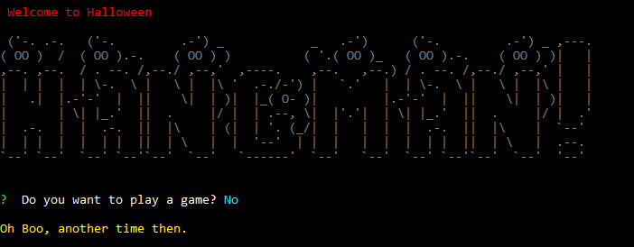
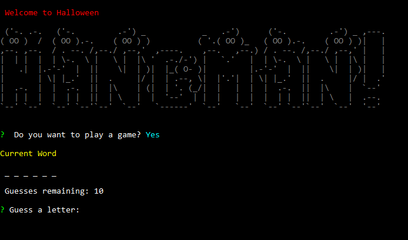
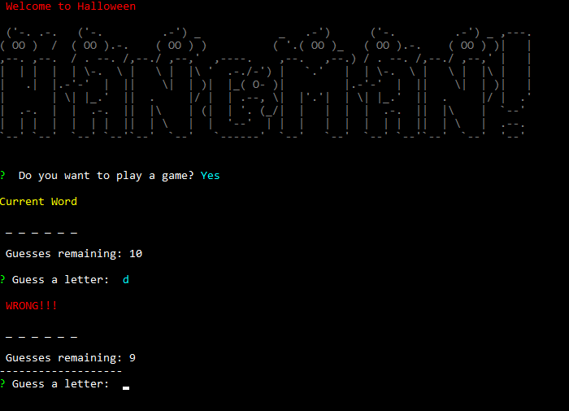
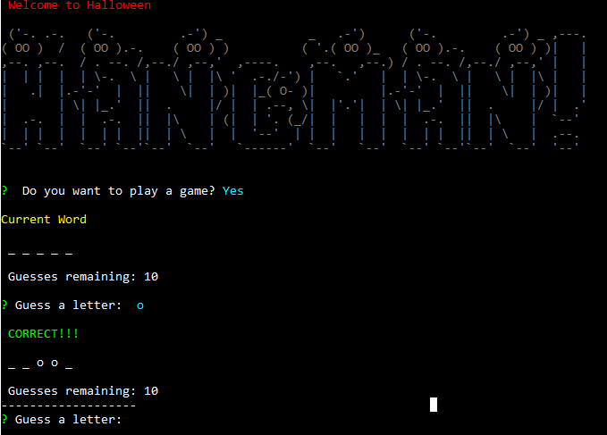
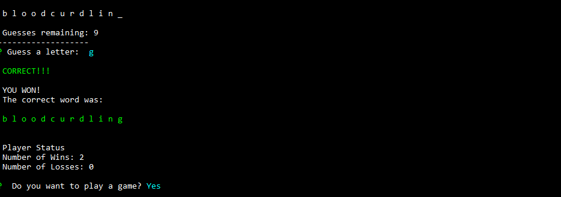
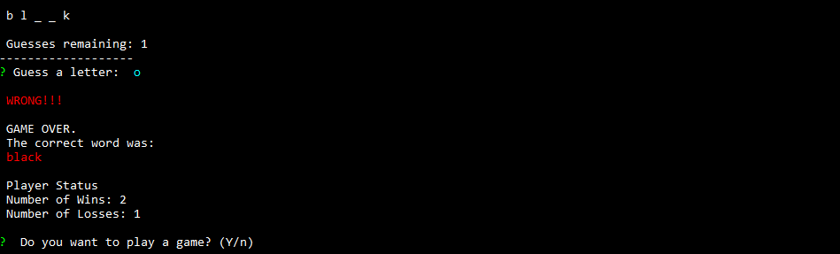

# Constructor Hangman Game
Constructor Hangman is a node js hangman game using constructor objects.

## Known Issues
* Input validation to limit guess to one 1etter.
* Input validation if repeat guess (user guesses letter already guessed).

## NPM Packages Used
*  inquirer
*  chalk
*  clear
*  figlet

## How to Run
* Download repository
* Install npm packages
* run "node main.js"

## Examples
1. Don't Play 

2. Play Game

3. Wrong Guess

4. Correct Guess

5. Win

6. Loss

